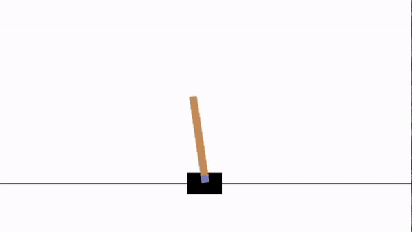

# Solving CartPole using Q-Learning

Uses Q-Learning (Bellman Equation) to train an agent to balance a pole upright on a movable cart. The optimal policy is found by exploring the environment and updating the Q-matrix, and action is chosen using Epsilon-Greedy exploration strategy.

The cartpole problem and visual rendering used is available thorugh [gymnasium](https://gymnasium.farama.org/). 

### Requirements
- Python 3.8+
- Jupyter Notebook
- gymnasium
- numpy

The code is broken down with Jupyter and located in the `cartpole.ipynb` file. To run the code cell by cell, run the `cartpole.ipynb` file.

To run the code all at once, run the `cartpole.py` file

### Cartpole with agent choosing random actions

### Cartpole with the agent choosing optimal policy after Q-learning

